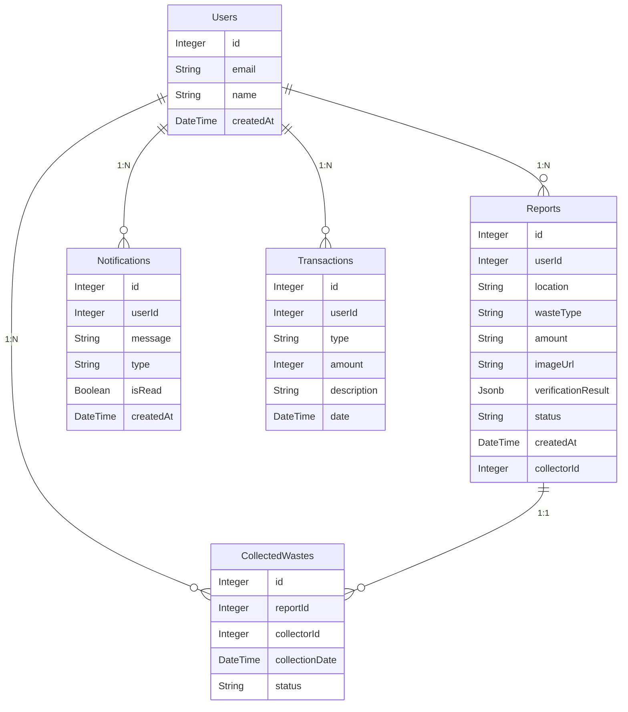

# ZeroWaste: An AI-Powered Waste Management Platform  

An innovative AI-powered waste management platform designed to incentivize and streamline waste reporting and collection. By fostering a community-driven approach to waste management, ZeroWaste rewards users for their eco-friendly actions, creating a greener and cleaner future.  

---

##  **Key Features**  

### **1. AI-Assisted Waste Verification**  
- Leverages Google’s Gemini AI to verify waste types and quantities with high accuracy.  
- Ensures efficient categorization and handling of waste.

### **2. User Reward System**  
- Encourages eco-friendly actions by awarding points for reported waste collection tasks.  
- Points can be used to climb the leaderboard and gain recognition in the community.

### **3. Real-Time Task Management**  
- Manages waste collection tasks dynamically to ensure timely and efficient waste pickup.

### **4. Interactive Leaderboard**  
- Engages the community by ranking users based on their eco-friendly contributions.  
- Promotes healthy competition and encourages increased participation.

---

## 🛠 **Tools and Technologies**  

### **Frontend**  
- **Next.js 14**: For building a robust, scalable, and efficient frontend.  
- **Tailwind CSS**: For responsive and visually appealing design.  
- **TypeScript**: To ensure type safety and improve developer productivity.  

### **Backend**  
- **Drizzle ORM**: For database integration and management.  
- **Google Gemini AI**: To integrate advanced AI capabilities for waste verification.  

### **Authentication**  
- **NextAuth**: Secure authentication mechanism.  

### **Deployment**  
- Next.js deployment tools to ensure smooth production-level deployment.

---
### Database Schema

---
## 🚀 **Project Setup Instructions**  

### **1. Prerequisites**  
- Node.js (version 18 or above)  
- npm or yarn package manager  
- Database setup compatible with Drizzle ORM  

### **2. Clone the Repository**  
```bash  
git clone https://github.com/tarungatla/ZeroWaste.git  
cd zerowaste  
```

### **3. Install Dependencies***
```bash
npm install  
```

### **4. Configure Environment Variables***
Create a .env.local file in the root directory and add the following:
```bash
DATABASE_URL=<Your Database URL>  
GOOGLE_CLIENT_ID=<Your Google Client ID>
GOOGLE_CLIENT_SECRET=<Your Google Client Secret>
NEXTAUTH_URL=http://localhost:3000/
NEXTAUTH_SECRET=<Your NextAuth Secret>
NEXT_PUBLIC_GEMINI_API_KEY=<Google Gemini AI API Key>  
```

### **5. Run the Development Server***
```bash
npm run dev
```
The app will be available at http://localhost:3000